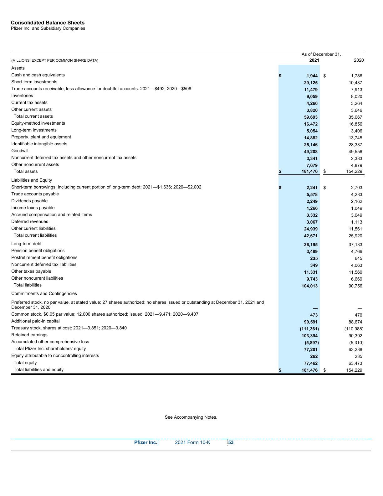
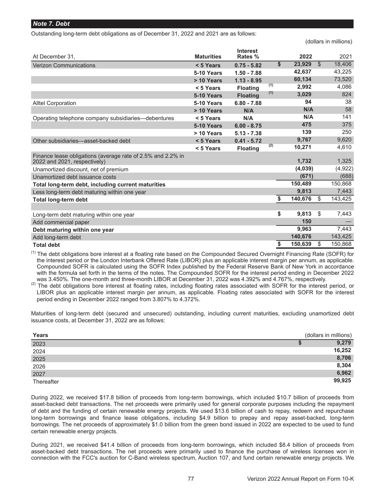
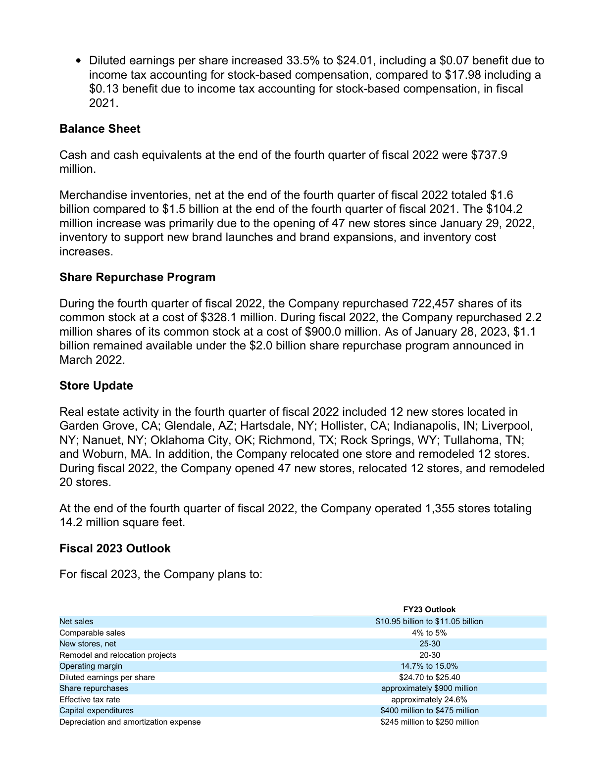
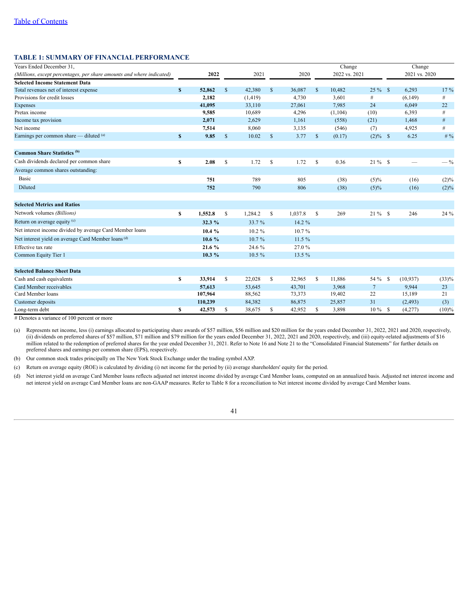
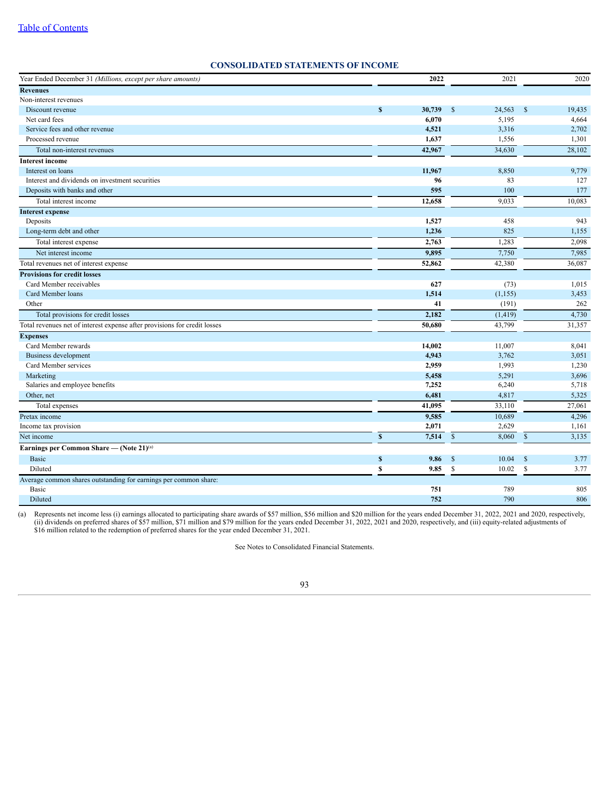

# Evidence Architecture - Table Extraction Recovery Audit

> 离线审计6个页码修正后仍缺TableStore结构的案例。未调用LLM/Jina，未修改生产pipeline。

## 汇总

- Cases: `6`; unique PDF pages: `5`。
- Classification: `{'B': 4, 'D': 2}`。
- Current parser accepted candidates: `0` pages。
- Rejected-only candidate pages: `6` pages。

## 分类口径

- **A parser漏检**：当前parser能产生accepted候选，但该页TableStore仍为空。
- **B 复杂布局**：parser找到区域但因列数、密度、段落化或碎片化被拒绝。
- **C OCR/图片**：页面图片主导且可提取文本不足。
- **D 结构已丢失但文本存在**：文本仍包含数值行，但没有结构候选。

## 案例

### financebench_id_00302 - B 复杂布局

- Question: Did Pfizer grow its PPNE between FY20 and FY21?
- Source: `pfizer_2021_10k.pdf`, internal page `58`, page ID `doc_0b30cbcfda359c01f026a1dc53ec4d069fa4176464b3daa620e318a6a228:page:000058`
- Reason: parser sees candidate regions but rejects or fragments them because of layout complexity
- Signals: `{'stored_table_count': 0, 'accepted_word_candidates': 0, 'rejected_word_candidates': 2, 'max_effective_columns': 21, 'table_like_text_lines': 42, 'raw_text_chars': 2131, 'document_page_text_chars': 2230, 'chunk_count': 0, 'evidence_text_recall_in_page': 1.0, 'evidence_line_count': 37, 'evidence_average_words_per_line': 1.22, 'evidence_prose_like': False, 'word_count': 294, 'image_count': 0, 'line_count': 16, 'rect_count': 175, 'width': 612.0, 'height': 792.0}`
- Parser reject reasons: `{'too_few_rows': 1, 'mostly_empty': 1}`
- Artifacts: [raw text](../output/pdf/table_extraction_recovery_audit6/financebench_id_00302_p000058/raw_text.txt) | [parser output](../output/pdf/table_extraction_recovery_audit6/financebench_id_00302_p000058/current_parser_output.json) | [table candidates](../output/pdf/table_extraction_recovery_audit6/financebench_id_00302_p000058/table_candidates.json)

Text preview: Consolidated Balance Sheets Pfizer Inc. and Subsidiary Companies As of December 31, (MILLIONS, EXCEPT PER COMMON SHARE DATA) 2021 2020 Assets Cash and cash equivalents $ 1,944 $ 1,786 Short-term investments 29,125 10,437 Trade accounts receivable, less allowance for doubtful accounts: 2021—$492; 2020—$508 11,479 7,913 Inventories 9,059 8,020 Current tax assets 4,266 3,264 Other current assets 3,820 3,646 Total current assets 59,693 35,067 Equity-method investments 16,472 16,856 Long-term investments 5,054 3,406 Property, plant and equipment 14,882 13,745 Identifiable intangible assets 25,146 2…

### financebench_id_00605 - D 表格结构已丢失但文本存在

- Question: What percent of Ulta Beauty's total spend on stock repurchases for FY 2023 occurred in Q4 of FY2023?
- Source: `ultabeauty_2023q4_earnings.pdf`, internal page `2`, page ID `doc_2c62ee5c8b303eee276917243cfb89a7f3c60f8e69135c56118e44efe966:page:000002`
- Reason: benchmark evidence is prose and is retained by text extraction; rejected table candidates are unrelated page regions
- Signals: `{'stored_table_count': 0, 'accepted_word_candidates': 0, 'rejected_word_candidates': 4, 'max_effective_columns': 18, 'table_like_text_lines': 19, 'raw_text_chars': 2239, 'document_page_text_chars': 2228, 'chunk_count': 0, 'evidence_text_recall_in_page': 1.0, 'evidence_line_count': 6, 'evidence_average_words_per_line': 8.83, 'evidence_prose_like': True, 'word_count': 346, 'image_count': 0, 'line_count': 0, 'rect_count': 21, 'width': 612.0, 'height': 792.0}`
- Parser reject reasons: `{'too_many_text_columns': 4}`
- Artifacts: [raw text](../output/pdf/table_extraction_recovery_audit6/financebench_id_00605_p000002/raw_text.txt) | [parser output](../output/pdf/table_extraction_recovery_audit6/financebench_id_00605_p000002/current_parser_output.json) | [table candidates](../output/pdf/table_extraction_recovery_audit6/financebench_id_00605_p000002/table_candidates.json)

Text preview: Diluted earnings per share increased 33.5% to $24.01, including a $0.07 benefit due to income tax accounting for stock-based compensation, compared to $17.98 including a $0.13 benefit due to income tax accounting for stock-based compensation, in fiscal 2021. Balance Sheet Cash and cash equivalents at the end of the fourth quarter of fiscal 2022 were $737.9 million. Merchandise inventories, net at the end of the fourth quarter of fiscal 2022 totaled $1.6 billion compared to $1.5 billion at the end of the fourth quarter of fiscal 2021. The $104.2 million increase was primarily due to the opening…

### financebench_id_00566 - B 复杂布局

- Question: Has Verizon increased its debt on balance sheet between 2022 and the 2021 fiscal period?
- Source: `verizon_2022_10k.pdf`, internal page `76`, page ID `doc_54e45903f6615e24ae8521bdc9adfc845170fbb78c16a6d0296eaa33d9d1:page:000076`
- Reason: parser sees candidate regions but rejects or fragments them because of layout complexity
- Signals: `{'stored_table_count': 0, 'accepted_word_candidates': 0, 'rejected_word_candidates': 2, 'max_effective_columns': 22, 'table_like_text_lines': 37, 'raw_text_chars': 3636, 'document_page_text_chars': 3613, 'chunk_count': 0, 'evidence_text_recall_in_page': 0.9813, 'evidence_line_count': 102, 'evidence_average_words_per_line': 0.97, 'evidence_prose_like': False, 'word_count': 555, 'image_count': 0, 'line_count': 8, 'rect_count': 31, 'width': 612.0, 'height': 792.0}`
- Parser reject reasons: `{'mostly_empty': 2}`
- Artifacts: [raw text](../output/pdf/table_extraction_recovery_audit6/financebench_id_00566_p000076/raw_text.txt) | [parser output](../output/pdf/table_extraction_recovery_audit6/financebench_id_00566_p000076/current_parser_output.json) | [table candidates](../output/pdf/table_extraction_recovery_audit6/financebench_id_00566_p000076/table_candidates.json)

Text preview: Note 7. Debt Outstanding long-term debt obligations as of December 31, 2022 and 2021 are as follows: (dollars in millions) At December 31, Maturities Interest Rates % 2022 2021 Verizon Communications < 5 Years 0.75 - 5.82 $ 23,929 $ 18,406 5-10 Years 1.50 - 7.88 42,637 43,225 > 10 Years 1.13 - 8.95 60,134 73,520 < 5 Years Floating (1) 2,992 4,086 5-10 Years Floating (1) 3,029 824 Alltel Corporation 5-10 Years 6.80 - 7.88 94 38 > 10 Years N/A N/A 58 Operating telephone company subsidiaries—debentures < 5 Years N/A N/A 141 5-10 Years 6.00 - 8.75 475 375 > 10 Years 5.13 - 7.38 139 250 Other subsi…

### financebench_id_00603 - D 表格结构已丢失但文本存在

- Question: What drove the increase in Ulta Beauty's merchandise inventories balance at end of FY2023?
- Source: `ultabeauty_2023q4_earnings.pdf`, internal page `2`, page ID `doc_2c62ee5c8b303eee276917243cfb89a7f3c60f8e69135c56118e44efe966:page:000002`
- Reason: benchmark evidence is prose and is retained by text extraction; rejected table candidates are unrelated page regions
- Signals: `{'stored_table_count': 0, 'accepted_word_candidates': 0, 'rejected_word_candidates': 4, 'max_effective_columns': 18, 'table_like_text_lines': 19, 'raw_text_chars': 2239, 'document_page_text_chars': 2228, 'chunk_count': 0, 'evidence_text_recall_in_page': 1.0, 'evidence_line_count': 8, 'evidence_average_words_per_line': 8.75, 'evidence_prose_like': True, 'word_count': 346, 'image_count': 0, 'line_count': 0, 'rect_count': 21, 'width': 612.0, 'height': 792.0}`
- Parser reject reasons: `{'too_many_text_columns': 4}`
- Artifacts: [raw text](../output/pdf/table_extraction_recovery_audit6/financebench_id_00603_p000002/raw_text.txt) | [parser output](../output/pdf/table_extraction_recovery_audit6/financebench_id_00603_p000002/current_parser_output.json) | [table candidates](../output/pdf/table_extraction_recovery_audit6/financebench_id_00603_p000002/table_candidates.json)

Text preview: Diluted earnings per share increased 33.5% to $24.01, including a $0.07 benefit due to income tax accounting for stock-based compensation, compared to $17.98 including a $0.13 benefit due to income tax accounting for stock-based compensation, in fiscal 2021. Balance Sheet Cash and cash equivalents at the end of the fourth quarter of fiscal 2022 were $737.9 million. Merchandise inventories, net at the end of the fourth quarter of fiscal 2022 totaled $1.6 billion compared to $1.5 billion at the end of the fourth quarter of fiscal 2021. The $104.2 million increase was primarily due to the opening…

### financebench_id_01351 - B 复杂布局

- Question: How much has the effective tax rate of American Express changed between FY2021 and FY2022?
- Source: `americanexpress_2022_10k.pdf`, internal page `43`, page ID `doc_238e9ce26b0a8e46ac727f85aa4582b211aa95eeb3037327f0ec75ebd01a:page:000043`
- Reason: parser sees candidate regions but rejects or fragments them because of layout complexity
- Signals: `{'stored_table_count': 0, 'accepted_word_candidates': 0, 'rejected_word_candidates': 1, 'max_effective_columns': 31, 'table_like_text_lines': 25, 'raw_text_chars': 2979, 'document_page_text_chars': 3018, 'chunk_count': 0, 'evidence_text_recall_in_page': 1.0, 'evidence_line_count': 192, 'evidence_average_words_per_line': 0.6, 'evidence_prose_like': False, 'word_count': 524, 'image_count': 0, 'line_count': 0, 'rect_count': 647, 'width': 612.0, 'height': 792.0}`
- Parser reject reasons: `{'mostly_empty': 1}`
- Artifacts: [raw text](../output/pdf/table_extraction_recovery_audit6/financebench_id_01351_p000043/raw_text.txt) | [parser output](../output/pdf/table_extraction_recovery_audit6/financebench_id_01351_p000043/current_parser_output.json) | [table candidates](../output/pdf/table_extraction_recovery_audit6/financebench_id_01351_p000043/table_candidates.json)

Text preview: Table of Contents TABLE 1: SUMMARY OF FINANCIAL PERFORMANCE Years Ended December 31, Change Change (Millions, except percentages, per share amounts and where indicated) 2022 2021 2020 2022 vs. 2021 2021 vs. 2020 Selected Income Statement Data Total revenues net of interest expense $ 52,862 $ 42,380 $ 36,087 $ 10,482 25 % $ 6,293 17 % Provisions for credit losses 2,182 (1,419) 4,730 3,601 # (6,149) # Expenses 41,095 33,110 27,061 7,985 24 6,049 22 Pretax income 9,585 10,689 4,296 (1,104) (10) 6,393 # Income tax provision 2,071 2,629 1,161 (558) (21) 1,468 # Net income 7,514 8,060 3,135 (546) (7…

### financebench_id_00720 - B 复杂布局

- Question: What drove gross margin change as of the FY2022 for American Express? If gross margin is not a useful metric for a company like this, then please state that and explain why.
- Source: `americanexpress_2022_10k.pdf`, internal page `95`, page ID `doc_238e9ce26b0a8e46ac727f85aa4582b211aa95eeb3037327f0ec75ebd01a:page:000095`
- Reason: parser sees candidate regions but rejects or fragments them because of layout complexity
- Signals: `{'stored_table_count': 0, 'accepted_word_candidates': 0, 'rejected_word_candidates': 3, 'max_effective_columns': 31, 'table_like_text_lines': 37, 'raw_text_chars': 2197, 'document_page_text_chars': 2215, 'chunk_count': 0, 'evidence_text_recall_in_page': 1.0, 'evidence_line_count': 157, 'evidence_average_words_per_line': 0.9, 'evidence_prose_like': False, 'word_count': 341, 'image_count': 0, 'line_count': 0, 'rect_count': 648, 'width': 612.0, 'height': 792.0}`
- Parser reject reasons: `{'too_few_rows': 1, 'mostly_empty': 2}`
- Artifacts: [raw text](../output/pdf/table_extraction_recovery_audit6/financebench_id_00720_p000095/raw_text.txt) | [parser output](../output/pdf/table_extraction_recovery_audit6/financebench_id_00720_p000095/current_parser_output.json) | [table candidates](../output/pdf/table_extraction_recovery_audit6/financebench_id_00720_p000095/table_candidates.json)

Text preview: Table of Contents CONSOLIDATED STATEMENTS OF INCOME Year Ended December 31 (Millions, except per share amounts) 2022 2021 2020 Revenues Non-interest revenues Discount revenue $ 30,739 $ 24,563 $ 19,435 Net card fees 6,070 5,195 4,664 Service fees and other revenue 4,521 3,316 2,702 Processed revenue 1,637 1,556 1,301 Total non-interest revenues 42,967 34,630 28,102 Interest income Interest on loans 11,967 8,850 9,779 Interest and dividends on investment securities 96 83 127 Deposits with banks and other 595 100 177 Total interest income 12,658 9,033 10,083 Interest expense Deposits 1,527 458 9…
